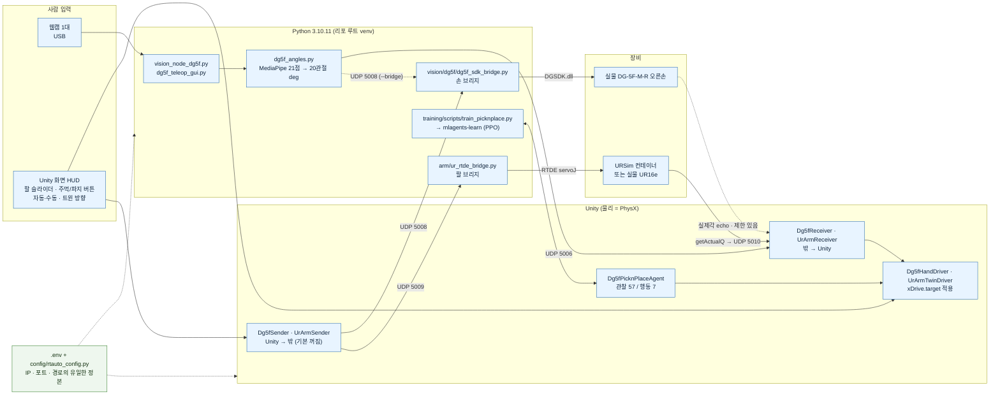
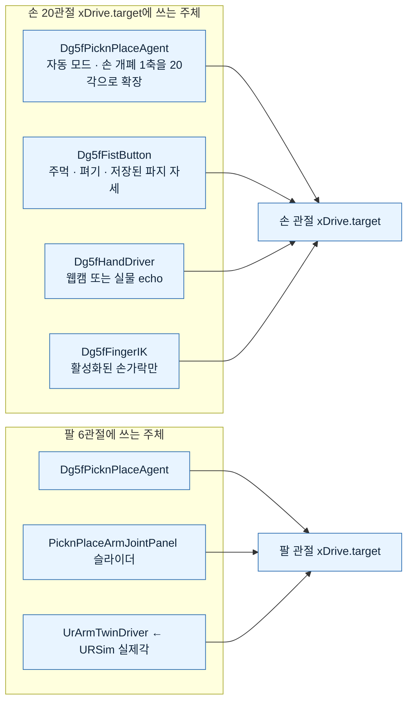
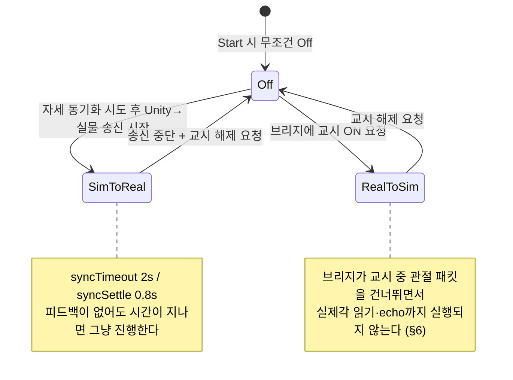
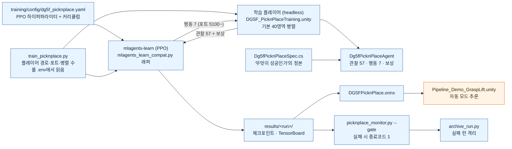
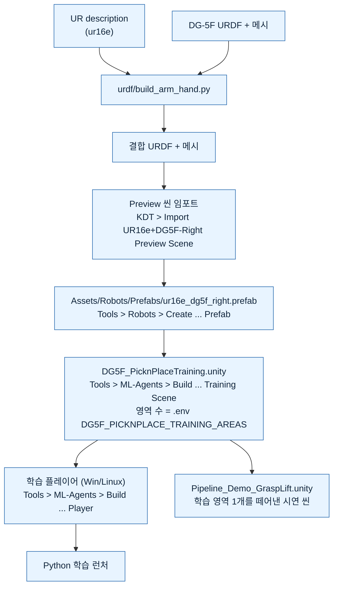
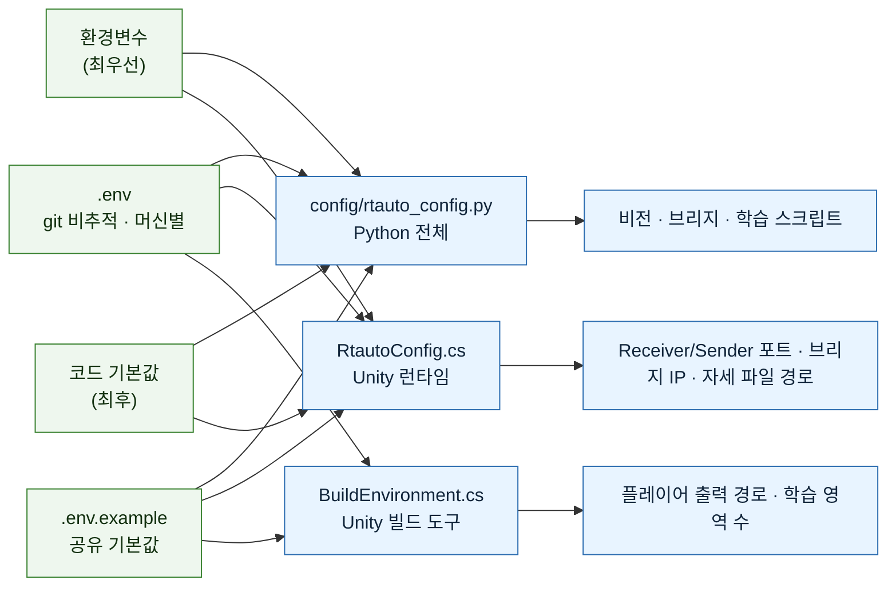
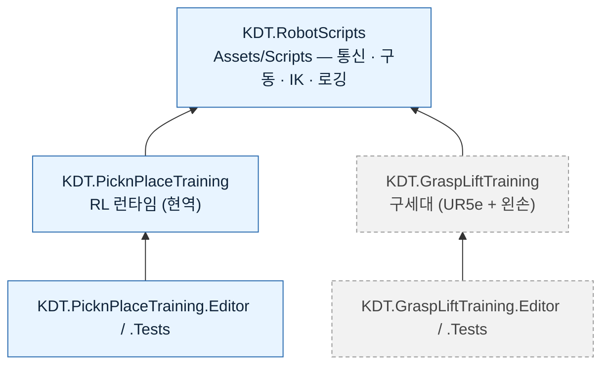
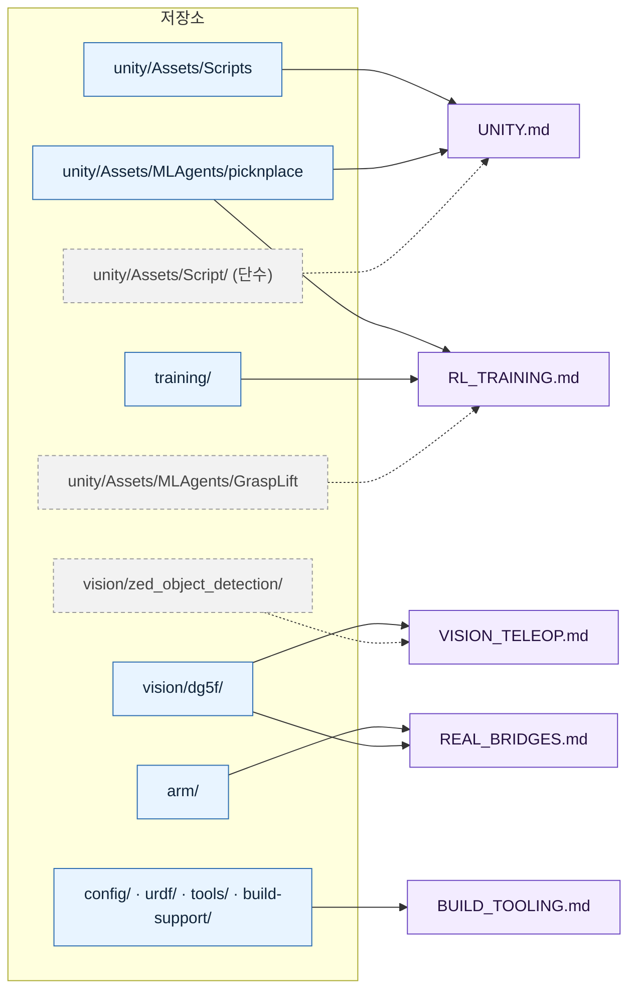

# 아키텍처 구조도 (ARCHITECTURE)

[`MODULE_GUIDE.md`](MODULE_GUIDE.md)가 글로 설명하는 연결을 **그림으로** 옮긴 문서다.
"무엇이 무엇에게 무엇을 보내는가"를 한눈에 보고, 상세는 각 모듈 문서로 들어간다.

- 그림은 [mermaid](https://mermaid.js.org/) 문법이다. **GitHub 웹, VS Code 마크다운 미리보기,
  IntelliJ 미리보기에서 그대로 렌더링**된다. 렌더링되지 않는 뷰어에서는 코드 블록의 텍스트로 읽거나
  [`MODULE_GUIDE.md`의 텍스트 흐름도](MODULE_GUIDE.md#전체-데이터-흐름-한-장-요약)를 본다.
- **값의 정본은 항상 코드다.** 그림의 포트·상수는 `.env`가 없을 때의 기본값이며,
  그림과 코드가 다르면 코드가 맞다(원칙 1 — 설정은 `config/rtauto_config.py` + `.env`).
- 2026-09-07 저장소 코드·씬 설정 대조 기준이다. **실물 재시험을 뜻하지 않는다.**
  화살표는 "사용 가능한 연결"이지 "동시에 다 켜라"가 아니다.

## 범례

| 표기 | 뜻 |
|---|---|
| 실선 화살표 | 현재 구현·사용 중인 연결 |
| 점선 화살표 | 조건부(옵션 플래그)이거나 **알려진 제한이 있는** 연결 |
| 파랑 상자 | 현역 구성요소 |
| 주황 상자 | 알려진 제한이 있어 완료로 취급하지 않는 구성요소 |
| 회색 점선 상자 | 이전 세대·폐기·잔재 |

---

## 1. 전체 시스템 한 장

**읽는 법**: 사람의 조작은 왼쪽(웹캠·HUD)에서 들어오고, 계산은 Python과 Unity가 나눠 가지며,
장비로 나가는 마지막 한 걸음은 **항상 Python 브리지**가 담당한다. Unity는 장비에 직접 붙지 않는다.
설정(초록)은 Python과 C#이 **같은 `.env` 파일을 각자 읽는다** — C#이 Python을 거치지 않는다.

---

## 2. 런타임 배선 — UDP 포트와 방향

실제 시연·디버깅에서 가장 자주 필요한 그림이다. 포트 번호는 기본값이다.

```mermaid
flowchart TD
  subgraph HANDPATH["손 경로"]
    VN["vision_node_dg5f.py<br/>웹캠 → 20관절 deg"]
    RXH["Dg5fReceiver<br/>listen 5006 · 20~72f"]
    HD["Dg5fHandDriver<br/>손 20관절 xDrive"]
    TXH["Dg5fSender<br/>sendEnabled 기본 false"]
    SW["Dg5fTwinModeSwitcher<br/>sim→real / real→sim / Off"]
    HB["dg5f_sdk_bridge.py<br/>listen 5008"]
    DG["실물 DG-5F 20모터"]
  end

  subgraph ARMPATH["팔 경로"]
    PANEL["PicknPlaceArmJointPanel<br/>UR16e 6축 슬라이더"]
    TXA["UrArmSender<br/>10Hz · 기본 false"]
    AB["ur_rtde_bridge.py<br/>listen 5009 · --hz 10"]
    UR["URSim / 실물 UR16e"]
    RXA["UrArmReceiver<br/>listen 5010"]
    TWIN["UrArmTwinDriver<br/>driveEnabled 기본 false"]
    LAUNCH["UrArmBridgeLauncher<br/>Unity 버튼이 브리지 프로세스 기동"]
  end

  VN -- "UDP 5006 · float32 x72" --> RXH
  VN -. "UDP 5008 (--bridge 옵션)" .-> HB
  RXH --> HD
  TXH -- "UDP 5008 · float32 x20 deg" --> HB
  SW -- "UDP 5008 · DG5FMODE + 1byte" --> HB
  HB -- "MoveServoJoint 20채널 · deg" --> DG
  DG -. "관절 명령 처리 뒤에만 읽음" .-> HB
  HB -. "UDP 5006 (--echo-to-unity)" .-> RXH

  PANEL --> TXA
  TXA -- "UDP 5009 · float32 x6 deg" --> AB
  AB -- "servoJ · rad" --> UR
  UR -- "getActualQ · rad" --> AB
  AB -. "UDP 5010 (--echo-to-unity)" .-> RXA
  RXA --> TWIN
  LAUNCH -.->|"프로세스 실행·정리"| AB

  classDef now fill:#e8f4ff,stroke:#2b6cb0,color:#10243a
  classDef limit fill:#fff4e5,stroke:#dd6b20,color:#3a2408
  class VN,RXH,HD,TXH,SW,DG,PANEL,TXA,AB,UR,RXA,TWIN,LAUNCH now
  class HB limit
```

### 포트 계약 표

| 포트(기본) | 방향 | 페이로드 | 정본 |
|---|---|---|---|
| **5006** `PORT_DG5F_SIM` | 비전 **또는** 손 브리지 echo → Unity | float32 × 20~72 (deg, 길이=버전 v1~v6) | `dg5f_angles.PACKET_FMT` ↔ `Dg5fReceiver.cs` |
| **5008** `PORT_DG5F_BRIDGE` | Unity/비전 → 손 브리지 | float32 × 20 (deg) **또는** `DG5FMODE`+1byte 제어 | `dg5f_sdk_bridge.py` |
| **5009** `PORT_UR_ARM_BRIDGE` | Unity → 팔 브리지 | float32 × 6 (deg) | `UrArmSender.cs` ↔ `ur_rtde_bridge.py` |
| **5010** `PORT_UR_ARM_SIM` | 팔 브리지 → Unity | float32 × 6 (deg) | `ur_rtde_bridge.py --echo-to-unity` |
| **5100~** `PORT_MLAGENTS_BASE` | 학습 트레이너 ↔ Unity 플레이어 | ML-Agents 자체 프로토콜 | `train_picknplace.py` |
| ~~5007~~ `PORT_ZED_TARGET` | — | **폐기 경로**(ZED 객체 검출). Unity 수신 컴포넌트도 이미 삭제됨 | [VISION_TELEOP §4](VISION_TELEOP.md) |

> ⚠️ **UDP 5006은 웹캠과 실물 손 echo가 공유한다.** `Dg5fReceiver`는 송신 출처를 구별하지 않으므로
> 둘을 동시에 켜면 값이 섞인다. 실물 실제각을 볼 때는 웹캠 송신을 멈춘다.
> 손 브리지가 주황인 이유는 §6의 **교시 중 피드백 제한** 때문이다.

---

## 3. 제어권 — 같은 관절에 누가 쓰는가

시연에서 "안 움직인다"의 대부분은 배선이 아니라 **제어권**이 원인이다.

**전환을 실제로 수행하는 메서드**(UI 버튼 뒤의 본체):

| 호출 | 효과 |
|---|---|
| `PicknPlaceControlModeSwitcher.SetManualMode(bool)` | 자동↔수동. 수동 진입 시 `agent.PauseForManualControl()` |
| `Dg5fFistButton.ReleaseHandToTracking()` | **웹캠 복귀.** 이걸 부르기 전엔 웹캠 패킷이 와도 손이 안 움직인다 |
| `Dg5fTwinModeSwitcher.SetMode(...)` | 손 트윈 방향. `Start()`에서 무조건 `Off`로 시작(안전) |
| `PicknPlaceArmJointPanel.SetActive / PullFromUrsim` | 팔 패널 활성화 · URSim 자세 끌어오기 |

### 손 트윈 방향 상태

> ⚠️ **되먹임 루프**: 송신과 수신을 동시에 켜면 `Unity 목표 → 로봇 → 실제각 → 다시 Unity 목표`로
> 서로를 덮어쓴다. 그래서 위 모드 전환 컴포넌트들이 방향을 상호배타로 강제한다.

---

## 4. 강화학습 루프

**관찰 57칸은 전부 시뮬레이터 내부 상태다.** 웹캠 텔레옵이 이 값을 공급하지 않는다.
물체 위치·속도(`13..21`)와 접촉(`38..42`, `49`)은 실물에 대응 신호가 없어, 실물 이관에서
"이 칸을 어디서 채울 것인가"가 남은 과제다. 정본은 `Dg5fPicknPlaceAgent.CollectObservations()`.

데모 씬이 주황인 이유: 저장된 씬의 `Dg5fPicknPlaceAgent`가 **비활성(`m_Enabled: 0`)**이고
자동 전환 코드가 이를 다시 켜지 않는다([UNITY §0](UNITY.md)).

---

## 5. 자산 생성 체인 — URDF에서 학습·데모까지

**씬 파일을 손으로 고치는 대신 이 체인을 다시 돌리는 게 규칙이다.**

> **원본을 고쳤다고 기존 씬·플레이어가 자동 갱신되지 않는다.** 코드를 바꿨는데 학습 지표가
> 그대로라면 **예전 빌드로 학습 중인지** 먼저 의심한다. 메뉴 전체 경로는 [UNITY §9-6](UNITY.md).

---

## 6. 설정 — 한 파일에서 세 구현이 각자 읽는다

우선순위: **환경변수 > `.env` > `.env.example` > 코드 기본값.**
파일을 바꿨는데 값이 그대로라면 실행한 터미널의 환경변수를 확인한다.
`RtautoConfig.cs`는 **절대 예외를 던지지 않고** 실패 시 기본값으로 조용히 떨어진다 —
"포트가 왜 다르지"는 Unity Console의 `ActivePort` 로그로 확인한다.
배포 실행파일에서 Python과 C#의 설정 탐색 위치가 다른 현재 제한은 [BUILD_TOOLING](BUILD_TOOLING.md)에 있다.

---

## 7. Unity 어셈블리 의존 방향

화살표는 **참조 방향**이다. 아래층(`KDT.RobotScripts`)이 위층을 참조하면 **순환 참조로 컴파일이 깨진다.**
그래서 관절 이름 같은 상수가 양쪽에 의도적으로 중복돼 있다
(`Dg5fPicknPlaceSpec.ArmLinks` ↔ `UrArmJointNames.Names`).

---

## 8. 저장소 지도 ↔ 문서 지도

회색 점선은 **현재 파이프라인 어디에도 연결돼 있지 않은 것**들이다.
`zed_object_detection`은 폐기(되살리는 것을 전제하지 않는다), `Assets/Script/`(단수)는
Rainbow Robotics 소켓 통신 잔재, `GraspLift`는 UR5e+왼손 이전 세대다.

---

## 9. 이 그림에서 점선이 뜻하는 것 — 현재 구현 경계

| 경계 | 상태 |
|---|---|
| 웹캠 → Unity 손 | **현역.** RL과 독립된 별도 경로 |
| Unity → 실물 손 (sim→real) | **현역.** `Dg5fSender`는 기본 꺼짐이라 의도적으로 켜야 움직인다 |
| 실물 손 → Unity (real→sim) | ⚠️ **미완료.** 브리지 반복문이 교시 중 관절 패킷을 `continue`로 건너뛰는데, 실제각 읽기·echo가 그 아래에 있어 **교시 중에는 실행되지 않는다** ([REAL_BRIDGES §2](REAL_BRIDGES.md)) |
| Unity ↔ URSim 팔 | 양방향 코드와 과거 검증 기록 있음. **실물 UR16e 재검증과는 구분** |
| RL 자동 파지 데모 | ⚠️ 저장된 데모 씬의 Agent가 비활성. 자동 전환이 다시 켜지 않음 ([UNITY §0](UNITY.md)) |
| 다중 카메라 3D 삼각측량 | 별도 실행·보정 경로. 텔레옵·RL 관찰에 자동 연결되지 않음 |
| 카메라로 물체를 찾아 실물 자율 파지 | **미착수.** 실물 관찰 조달 · 좌표 변환 · 검증이 남아 있다 |
| 그리퍼 동시 접속 | 불가. DG-5F는 프로토콜과 무관하게 **TCP 세션 1개만** 받는다 (DGManager를 켜두면 브리지가 붙지 않는다) |

---

## 관련 문서

- [`MODULE_GUIDE.md`](MODULE_GUIDE.md) — 이 그림들의 글 버전, 모듈 문서 입구
- [`UNITY.md`](UNITY.md) · [`RL_TRAINING.md`](RL_TRAINING.md) · [`VISION_TELEOP.md`](VISION_TELEOP.md) ·
  [`REAL_BRIDGES.md`](REAL_BRIDGES.md) · [`BUILD_TOOLING.md`](BUILD_TOOLING.md)
- [`docs/SIM2REAL_ROADMAP.md`](../SIM2REAL_ROADMAP.md) — 아키텍처 확정 사항·단계별 계획(최상위 정본)
- [`CLAUDE.md`](../../CLAUDE.md) — 프로젝트 최상위 지침(원칙 1·2·3)

---

## 문서 이력

| 버전 | 변경 일자 | 변경자 | 변경 내용 | 변경 사유 |
|---|---|---|---|---|
| v1.0 | 2026-09-07 | devlkb | 최초 작성 — mermaid 구조도 8종 | 텍스트 흐름도만으로는 모듈 간 연결·제어권·현재 경계가 한눈에 안 들어와, 인수인계 시 그림 한 장으로 전체를 잡을 수 있게 |

- **근거 기준**: 2026-09-07 저장소 **코드·설정 대조** 및 같은 날 작성된 `docs/modules/**` 5종.
  실물 재시험이나 성능 재검증을 뜻하지 않는다.
- **변경자·상세 diff의 정본은 git 이력**이다: `git log --follow -- docs/modules/ARCHITECTURE.md`
- **갱신 대상**: 포트·컴포넌트 이름·연결 방향이 바뀌면 이 문서의 그림과 §9 경계 표를 함께 고친다.
  그림은 **모듈 문서의 파생물**이므로, 모듈 문서를 고치면 여기도 본다.
- **용어는 [`GLOSSARY`](../GLOSSARY.md)를 따른다.** 새 용어를 쓰려면 거기에 먼저 추가한다.
